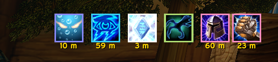
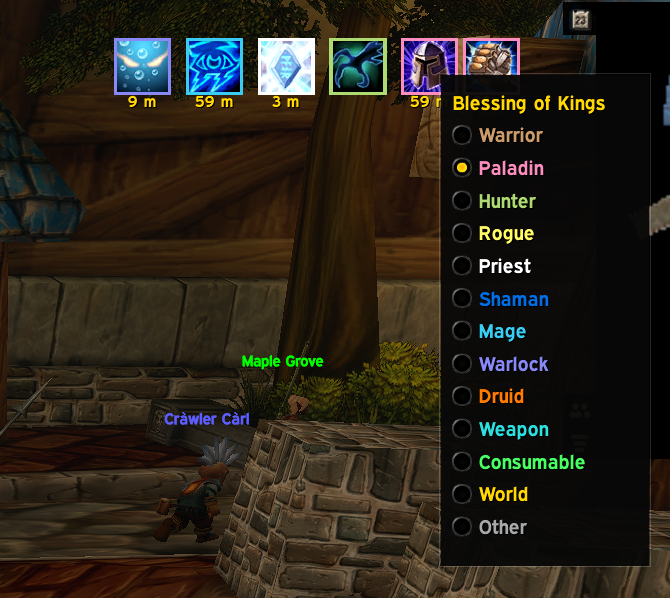
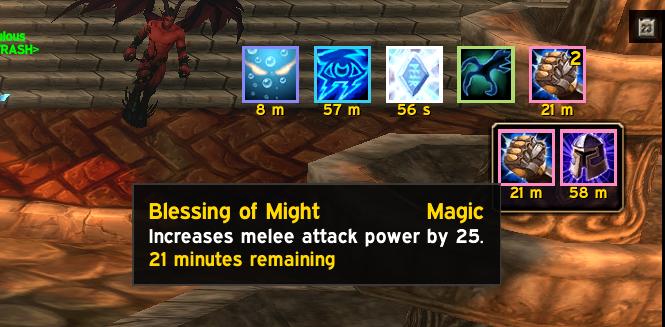
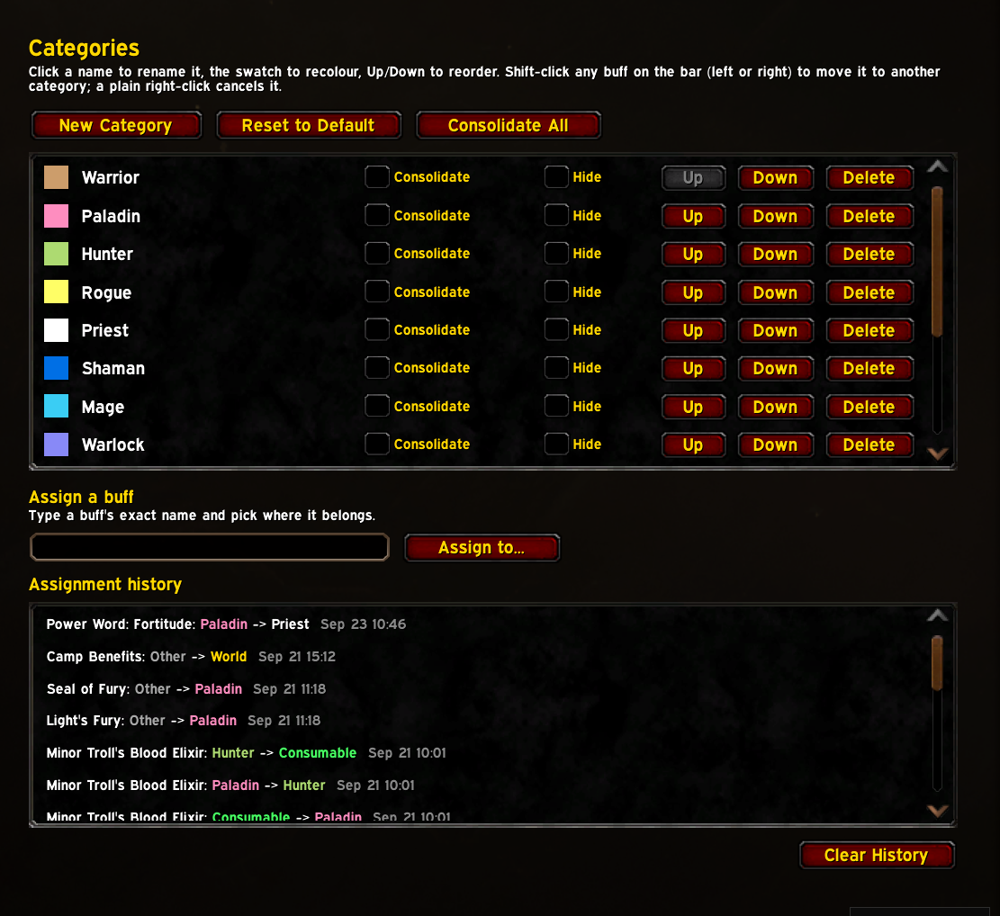

# BuffLedger

A buff bar for **World of Warcraft: Forever** that sorts your buffs into colour-coded categories. Mage buffs sit together with a mage-blue border, paladin blessings in pink, your food and elixirs in green, and so on. You can see at a glance who buffed you, what you're missing, and what's about to fall off.

Everything about the categories is yours to change: rename them, recolour them, reorder them, make new ones, and move any buff to wherever you think it belongs.

## Install

1. Copy the `BuffLedger` folder into `World of Warcraft\_classic_beta_\Interface\AddOns\`.
2. Enable it on the AddOns list.

The bar takes the place of the default buff frame, in exactly the same spot, and works straight away. There's nothing to set up.

## Features

### Buffs sorted by category

Every buff lands in a category, and each category has its own border colour:

- **One category per class**, in class colours: Warrior, Paladin, Hunter, Rogue, Priest, Shaman, Mage, Warlock and Druid.
- **Weapon**: poisons, oils, sharpening stones and shaman weapon imbues.
- **Consumable**: food, elixirs, flasks and scrolls.
- **World**: world buffs and other buffs from the environment.
- **Other**: anything BuffLedger doesn't recognise yet.

BuffLedger knows a long list of buffs out of the box. For anything it doesn't know, it looks at who cast it: a buff from a druid goes under Druid. Whatever you decide yourself always wins.

### Move any buff with a shift-click

**Shift-click** (left or right) any buff on the bar and pick a category from the menu. The buff goes there from then on, on every character. A **plain right-click** cancels the buff, as usual.

### Consolidation

Raid buffs can take over a whole row. Mark a category to **consolidate** and it collapses into a single icon with a count in the corner. **Hover it** and the full set pops out underneath. Buffs in the pop-out can be shift-clicked and right-clicked just like the ones on the bar.

You can consolidate categories one by one, all at once with **Consolidate All**, or only while you're in a party or raid.

### A Categories page for everything else

Open it from **Esc → Options → AddOns → BuffLedger → Categories** or with `/bl categories`:

- **Rename** a category by clicking its name, and **recolour** it by clicking its swatch.
- **Reorder** categories with **Up** / **Down**. The order here is the order on the bar.
- **New Category** adds your own, such as "Tank buffs" or "Things I need for this raid".
- **Hide** a category you never want to see, or **Delete** it (its buffs move to Other).
- **Assign a buff** by typing its name. This is handy for buffs you don't have up right now.
- **Assignment history** shows every buff you've moved, and a right-click moves one again.
- **Reset to Default** brings back any default category you deleted without touching your own.

### A separate debuff bar

Debuffs get their own bar, with a border coloured by type: blue for Magic, purple for Curse, brown for Disease and green for Poison. It sits where the default debuff frame was and has its own settings page.

### Weapon enchants

Poisons, oils, stones and shaman imbues show at the start of the bar with their time left and charges. Hover one to see the weapon's tooltip.

### Works in combat

The bar keeps updating in combat, so buffs appear, tick down and drop off just as they should. You can't move buffs between categories in combat; do that once the fight's over.

## Moving and styling the bar

- **Edit Mode** moves the bars: move the Buffs or Debuffs frame there and BuffLedger follows.
- You can also **unlock** a bar in Settings (or type `/bl unlock`) and drag it anywhere. **Reset Position** puts it back.
- Each bar has its own **icon size, spacing, gap between categories, icons per row, border thickness, scale**, and settings for **growing left or right**, a **background panel**, and showing the **time inside the icon** instead of below it.
- The default buff and debuff frames are hidden while BuffLedger is running. There's a checkbox to bring them back.
- An optional **minimap button**. BuffLedger is also in the minimap's addon menu.

## Commands

| Command | |
|---|---|
| `/bl` | list the commands |
| `/bl options` | open the settings |
| `/bl categories` | open the Categories page |
| `/bl lock`, `/bl unlock` | lock or unlock the buff bar |
| `/bl reset` | put the buff bar back where it started |
| `/bl toggle <category>` | show or hide one category |
| `/bl test` | preview the bar with a sample of every known buff (`/bl test off` to stop) |
| `/bl scan` | list buffs on your group that BuffLedger doesn't recognise yet |
| `/bl auras` | print your current buffs and debuffs to chat |

`/buffledger` works too.

## License

MIT - see [LICENSE](LICENSE).
